# Bot-Time!

# Project 2 Fintech 
- The goal of the Bot-Time project is to create a profitable automated trading bot that predicts a stocks price and takes a profitable trade accordingly.

- A demo account has been setup on WeBull that is being migrated to a live trading account.

- Several RNN were constructed and fitted to determine buying and selling decisions.

- We compared the performance of these models and the third model was deamed the best to build the automated trading bot around.

- Dash Gallery was used to create the front-end that enables user to monitor the bot's performance and to place the trades.

# Model 1
## Gathering the Data:
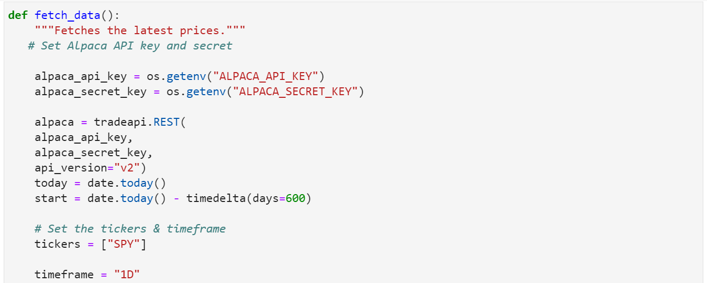
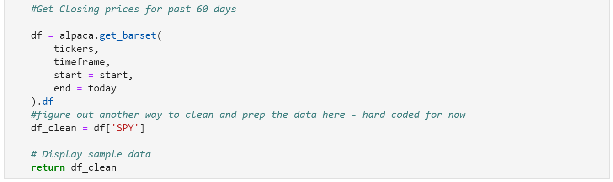

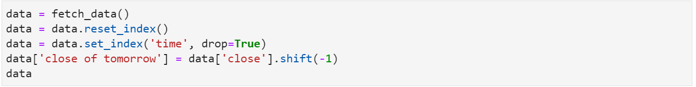
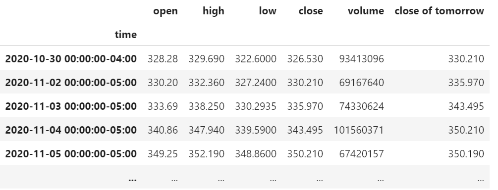
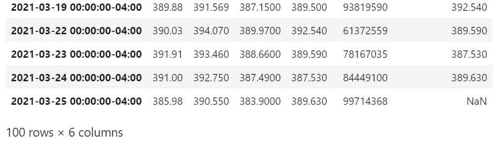

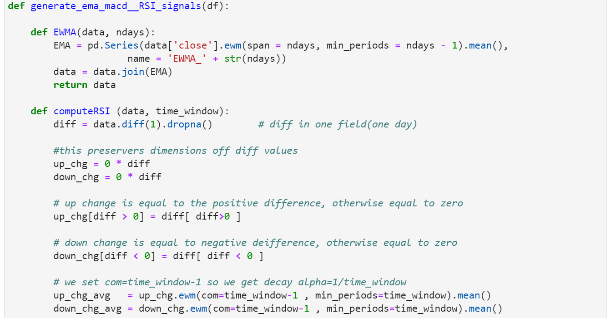
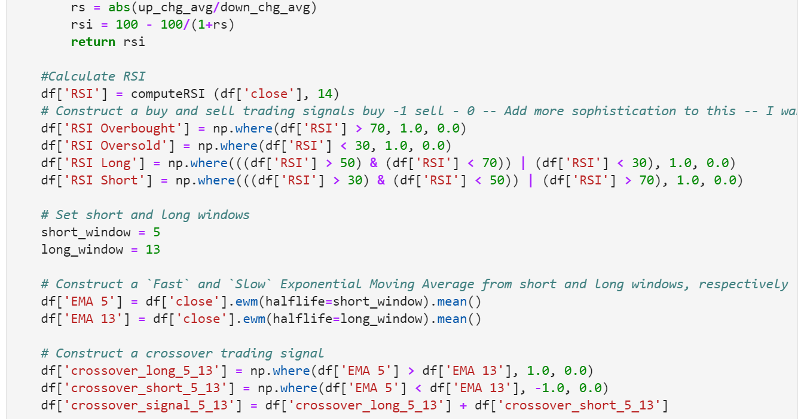
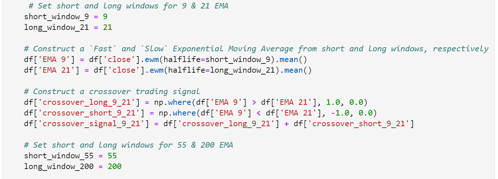
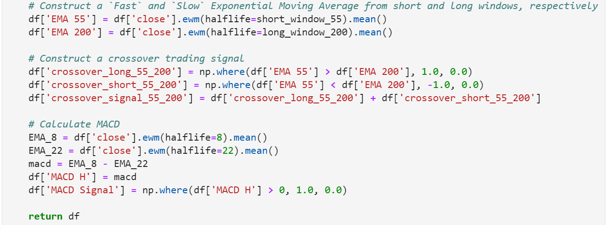

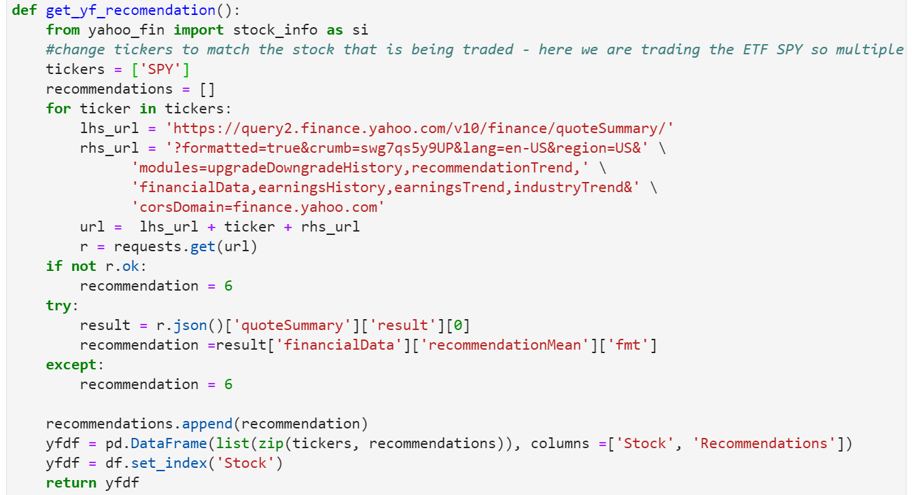

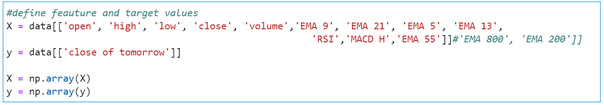

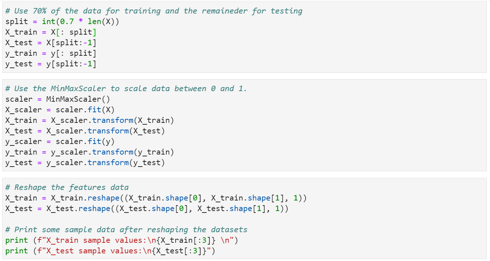

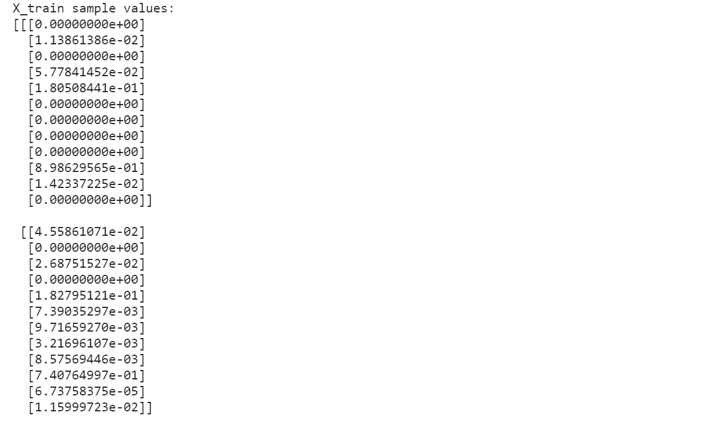
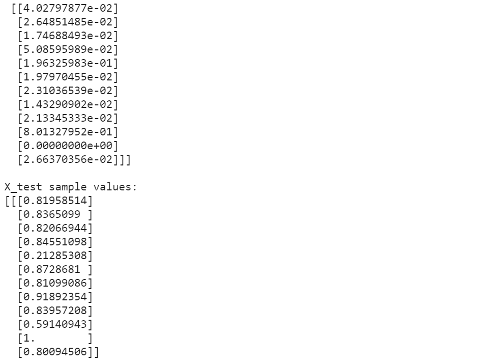
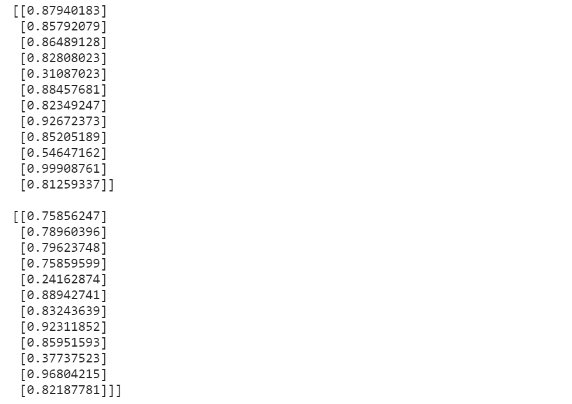

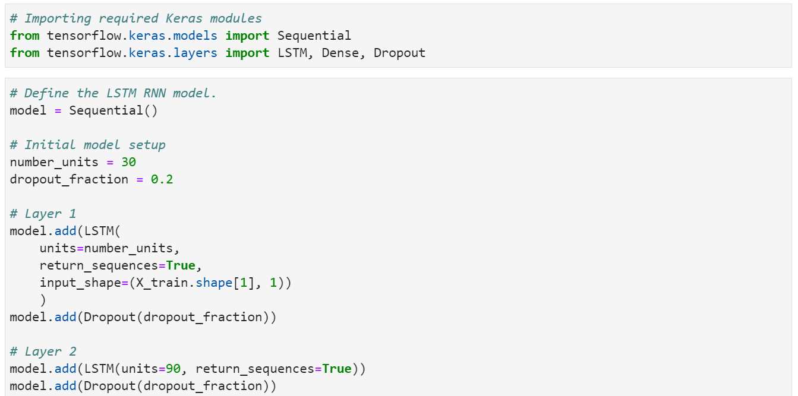
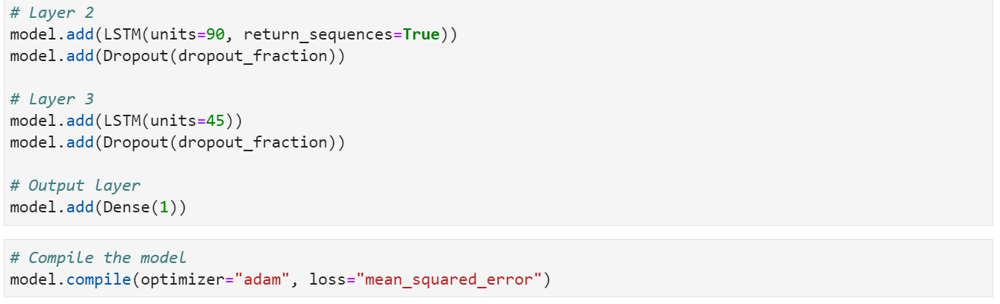

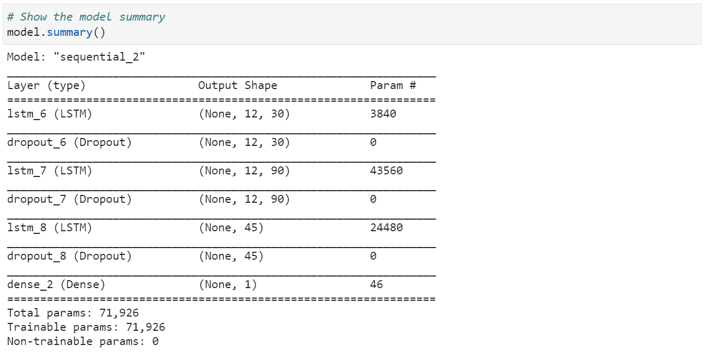

Epoch 1/100
1/1 [==============================] - 6s 6s/step - loss: 0.2777
Epoch 2/100
1/1 [==============================] - 0s 21ms/step - loss: 0.2365
Epoch 3/100
1/1 [==============================] - 0s 19ms/step - loss: 0.1976
Epoch 4/100
1/1 [==============================] - 0s 21ms/step - loss: 0.1586
Epoch 5/100
1/1 [==============================] - 0s 21ms/step - loss: 0.1182
Epoch 6/100
1/1 [==============================] - 0s 27ms/step - loss: 0.0834
Epoch 7/100
1/1 [==============================] - 0s 30ms/step - loss: 0.0547
Epoch 8/100
1/1 [==============================] - 0s 25ms/step - loss: 0.0269
Epoch 9/100
1/1 [==============================] - 0s 22ms/step - loss: 0.0178
Epoch 10/100
1/1 [==============================] - 0s 27ms/step - loss: 0.0252
Epoch 11/100
1/1 [==============================] - 0s 20ms/step - loss: 0.0475
Epoch 12/100
1/1 [==============================] - 0s 24ms/step - loss: 0.0569
Epoch 13/100
1/1 [==============================] - 0s 24ms/step - loss: 0.0460
Epoch 14/100
1/1 [==============================] - 0s 22ms/step - loss: 0.0266
Epoch 15/100
1/1 [==============================] - 0s 29ms/step - loss: 0.0204
Epoch 16/100
1/1 [==============================] - 0s 27ms/step - loss: 0.0159
Epoch 17/100
1/1 [==============================] - 0s 25ms/step - loss: 0.0146
Epoch 18/100
1/1 [==============================] - 0s 22ms/step - loss: 0.0248
Epoch 19/100
1/1 [==============================] - 0s 28ms/step - loss: 0.0236
Epoch 20/100
1/1 [==============================] - 0s 21ms/step - loss: 0.0305
Epoch 21/100
1/1 [==============================] - 0s 20ms/step - loss: 0.0265
Epoch 22/100
1/1 [==============================] - 0s 29ms/step - loss: 0.0285
Epoch 23/100
1/1 [==============================] - 0s 24ms/step - loss: 0.0234
Epoch 24/100
1/1 [==============================] - 0s 23ms/step - loss: 0.0248
Epoch 25/100
1/1 [==============================] - 0s 23ms/step - loss: 0.0181
Epoch 26/100
1/1 [==============================] - 0s 26ms/step - loss: 0.0155
Epoch 27/100
1/1 [==============================] - 0s 26ms/step - loss: 0.0132
Epoch 28/100
1/1 [==============================] - 0s 23ms/step - loss: 0.0130
Epoch 29/100
1/1 [==============================] - 0s 25ms/step - loss: 0.0140
Epoch 30/100
1/1 [==============================] - 0s 22ms/step - loss: 0.0191
Epoch 31/100
1/1 [==============================] - 0s 22ms/step - loss: 0.0195
Epoch 32/100
1/1 [==============================] - 0s 26ms/step - loss: 0.0213
Epoch 33/100
1/1 [==============================] - 0s 29ms/step - loss: 0.0136
Epoch 34/100
1/1 [==============================] - 0s 21ms/step - loss: 0.0154
Epoch 35/100
1/1 [==============================] - 0s 27ms/step - loss: 0.0134
Epoch 36/100
1/1 [==============================] - 0s 27ms/step - loss: 0.0117
Epoch 37/100
1/1 [==============================] - 0s 38ms/step - loss: 0.0101
Epoch 38/100
1/1 [==============================] - 0s 26ms/step - loss: 0.0138
Epoch 39/100
1/1 [==============================] - 0s 28ms/step - loss: 0.0158
Epoch 40/100
1/1 [==============================] - 0s 34ms/step - loss: 0.0104
Epoch 41/100
1/1 [==============================] - 0s 34ms/step - loss: 0.0105
Epoch 42/100
1/1 [==============================] - ETA: 0s - loss: 0.010 - 0s 41ms/step - loss: 0.0108
Epoch 43/100
1/1 [==============================] - 0s 32ms/step - loss: 0.0091
Epoch 44/100
1/1 [==============================] - 0s 32ms/step - loss: 0.0097
Epoch 45/100
1/1 [==============================] - 0s 36ms/step - loss: 0.0080
Epoch 46/100
1/1 [==============================] - 0s 35ms/step - loss: 0.0073
Epoch 47/100
1/1 [==============================] - 0s 33ms/step - loss: 0.0080
Epoch 48/100
1/1 [==============================] - 0s 33ms/step - loss: 0.0106
Epoch 49/100
1/1 [==============================] - 0s 33ms/step - loss: 0.0098
Epoch 50/100
1/1 [==============================] - 0s 31ms/step - loss: 0.0105
Epoch 51/100
1/1 [==============================] - 0s 36ms/step - loss: 0.0122
Epoch 52/100
1/1 [==============================] - 0s 37ms/step - loss: 0.0081
Epoch 53/100
1/1 [==============================] - 0s 31ms/step - loss: 0.0086
Epoch 54/100
1/1 [==============================] - 0s 35ms/step - loss: 0.0089
Epoch 55/100
1/1 [==============================] - 0s 34ms/step - loss: 0.0083
Epoch 56/100
1/1 [==============================] - 0s 35ms/step - loss: 0.0089
Epoch 57/100
1/1 [==============================] - 0s 31ms/step - loss: 0.0067
Epoch 58/100
1/1 [==============================] - 0s 32ms/step - loss: 0.0089
Epoch 59/100
1/1 [==============================] - 0s 34ms/step - loss: 0.0080
Epoch 60/100
1/1 [==============================] - 0s 34ms/step - loss: 0.0084
Epoch 61/100
1/1 [==============================] - 0s 34ms/step - loss: 0.0076
Epoch 62/100
1/1 [==============================] - 0s 35ms/step - loss: 0.0103
Epoch 63/100
1/1 [==============================] - 0s 30ms/step - loss: 0.0109
Epoch 64/100
1/1 [==============================] - 0s 33ms/step - loss: 0.0085
Epoch 65/100
1/1 [==============================] - 0s 33ms/step - loss: 0.0054
Epoch 66/100
1/1 [==============================] - 0s 27ms/step - loss: 0.0065
Epoch 67/100
1/1 [==============================] - 0s 28ms/step - loss: 0.0061
Epoch 68/100
1/1 [==============================] - 0s 34ms/step - loss: 0.0087
Epoch 69/100
1/1 [==============================] - 0s 35ms/step - loss: 0.0092
Epoch 70/100
1/1 [==============================] - 0s 30ms/step - loss: 0.0095
Epoch 71/100
1/1 [==============================] - 0s 34ms/step - loss: 0.0084
Epoch 72/100
1/1 [==============================] - 0s 32ms/step - loss: 0.0075
Epoch 73/100
1/1 [==============================] - 0s 39ms/step - loss: 0.0063
Epoch 74/100
1/1 [==============================] - 0s 34ms/step - loss: 0.0099
Epoch 75/100
1/1 [==============================] - 0s 46ms/step - loss: 0.0072
Epoch 76/100
1/1 [==============================] - 0s 45ms/step - loss: 0.0082
Epoch 77/100
1/1 [==============================] - 0s 31ms/step - loss: 0.0088
Epoch 78/100
1/1 [==============================] - 0s 34ms/step - loss: 0.0080
Epoch 79/100
1/1 [==============================] - 0s 35ms/step - loss: 0.0077
Epoch 80/100
1/1 [==============================] - 0s 36ms/step - loss: 0.0050
Epoch 81/100
1/1 [==============================] - 0s 34ms/step - loss: 0.0077
Epoch 82/100
1/1 [==============================] - 0s 39ms/step - loss: 0.0080
Epoch 83/100
1/1 [==============================] - 0s 32ms/step - loss: 0.0072
Epoch 84/100
1/1 [==============================] - 0s 34ms/step - loss: 0.0078
Epoch 85/100
1/1 [==============================] - 0s 36ms/step - loss: 0.0073
Epoch 86/100
1/1 [==============================] - 0s 38ms/step - loss: 0.0070
Epoch 87/100
1/1 [==============================] - 0s 37ms/step - loss: 0.0056
Epoch 88/100
1/1 [==============================] - 0s 43ms/step - loss: 0.0051
Epoch 89/100
1/1 [==============================] - 0s 37ms/step - loss: 0.0077
Epoch 90/100
1/1 [==============================] - 0s 37ms/step - loss: 0.0070
Epoch 91/100
1/1 [==============================] - 0s 38ms/step - loss: 0.0076
Epoch 92/100
1/1 [==============================] - 0s 36ms/step - loss: 0.0061
Epoch 93/100
1/1 [==============================] - 0s 35ms/step - loss: 0.0105
Epoch 94/100
1/1 [==============================] - 0s 44ms/step - loss: 0.0093
Epoch 95/100
1/1 [==============================] - 0s 42ms/step - loss: 0.0074
Epoch 96/100
1/1 [==============================] - 0s 36ms/step - loss: 0.0066
Epoch 97/100
1/1 [==============================] - 0s 34ms/step - loss: 0.0073
Epoch 98/100
1/1 [==============================] - 0s 35ms/step - loss: 0.0061
Epoch 99/100
1/1 [==============================] - 0s 44ms/step - loss: 0.0101
Epoch 100/100
1/1 [==============================] - 0s 33ms/step - loss: 0.0074
<tensorflow.python.keras.callbacks.History at 0x1bd5815e588>

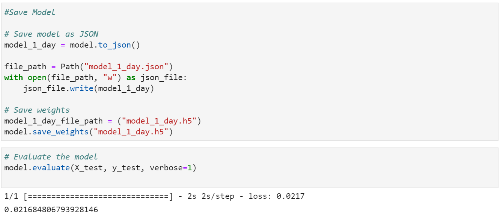

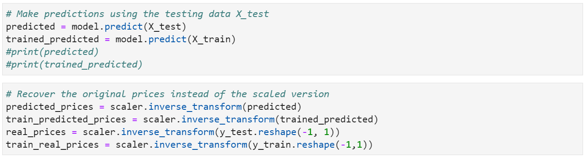

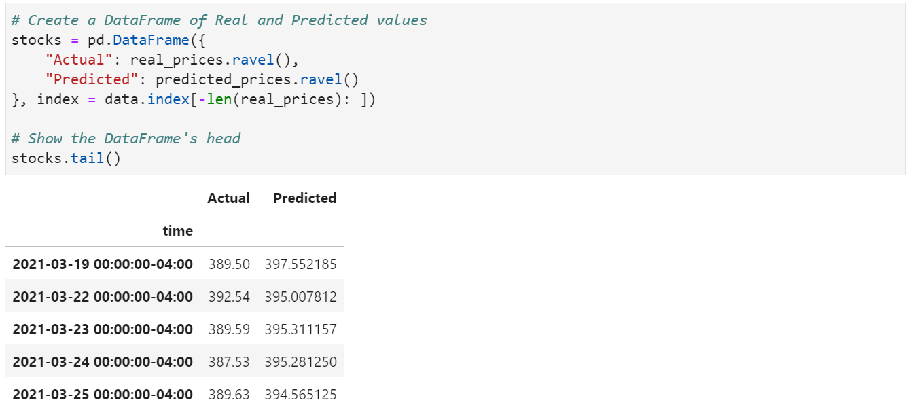
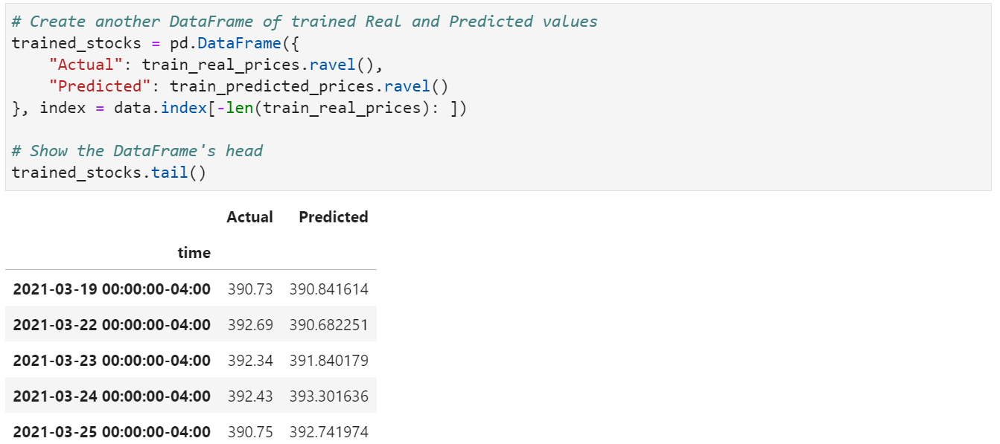

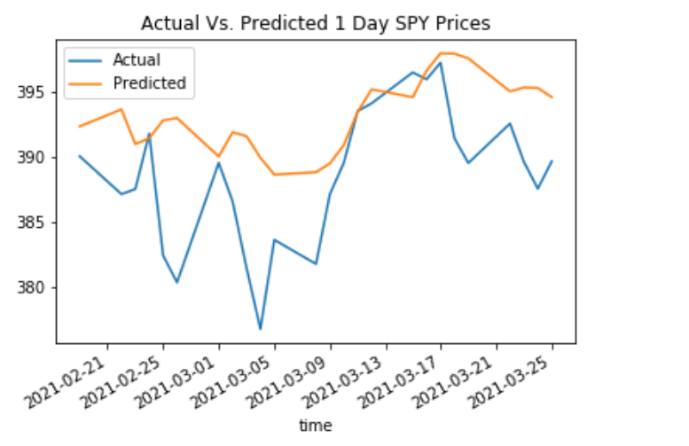

# Model 3
## Gathering the Data:
The Ticker Price Data was read in from Yahoo Finance.  The Open, High, Low, Adjusted Close and the Volume were the feature Columns.

## Test-Train-Split:
Preparing the data for the model.

We trained the data.

## Load for Dash:
Data is being prepared so it can be displayed in Dash.

## Get Final Data:
This function takes the "model" and "data" dict to construct a final dataframe that includes the features along with true and predicted prices of the testing dataset

## Prediction:

## Accuracy:

# Data Visualizations:
When deciding on a trading strategy, one might consider using indicators to help guide the decision whether to buy, sell or hold a position. Some of the indicators explored in the Bot-Time project are Bollinger Bands, EMA Crossover Point and RSI Indicators.  Here are some illustrations that show how they were used in the Bot-Time strategy.

## Plot:

## Some Dash Visualizations:
Bollinger Bands:

EMA Crossover Points:

Prediction Chart:

RSI Indicator Chart:

Webull Options Chain:

## Final Analysis:
Throughout the project, several models were tested, however, our third model proved to be the most accurate.

