# Bot-Time!

# Project 2 Fintech 
- The goal of the Bot-Time project is to create a profitable automated trading bot that predicts a stocks price and takes a profitable trade accordingly.

- A demo account has been setup on WeBull that is being migrated to a live trading account.

- Several RNN were constructed and fitted to determine buying and selling decisions.

- We compared the performance of these models and the third model was deamed the best to build the automated trading bot around.

- Dash Gallery was used to create the front-end that enables user to monitor the bot's performance and to place the trades.

# The Project
## Gathering the Data:
The Ticker Price Data was read in from Yahoo Finance.  The Open, High, Low, Adjusted Close and the Volume were the feature Columns.
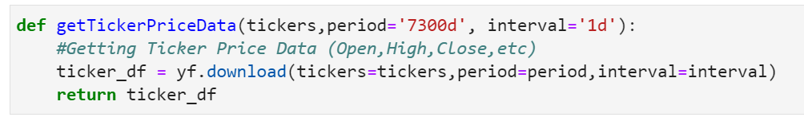
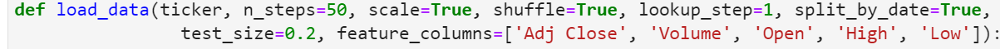

## Test-Train-Split:
Preparing the data for the model.
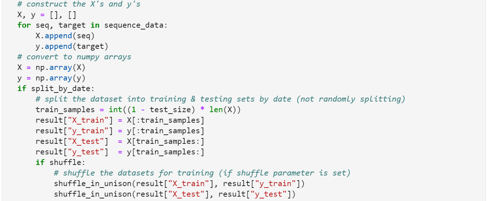
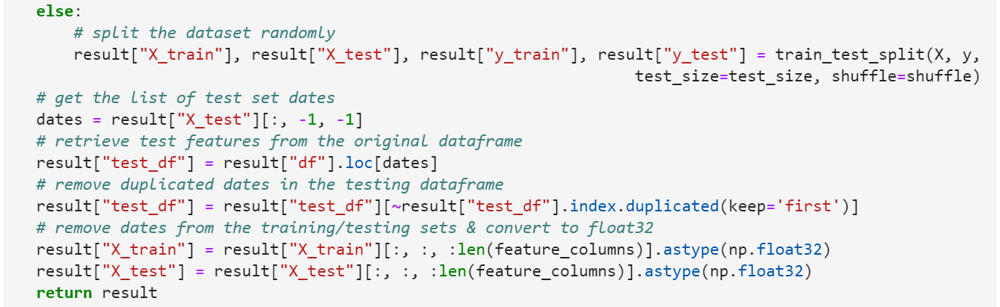

We trained the data.
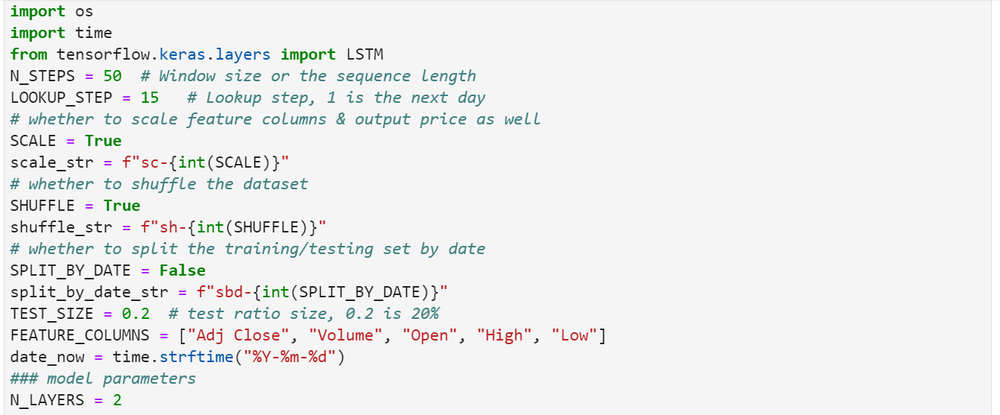
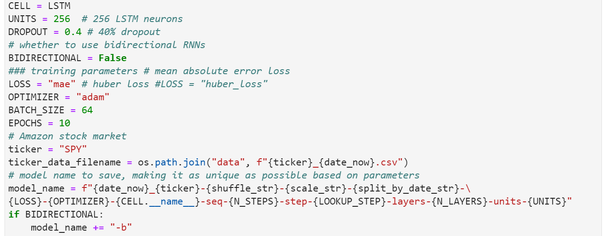

## Load for Dash:
Data is being prepared so it can be displayed in Dash.
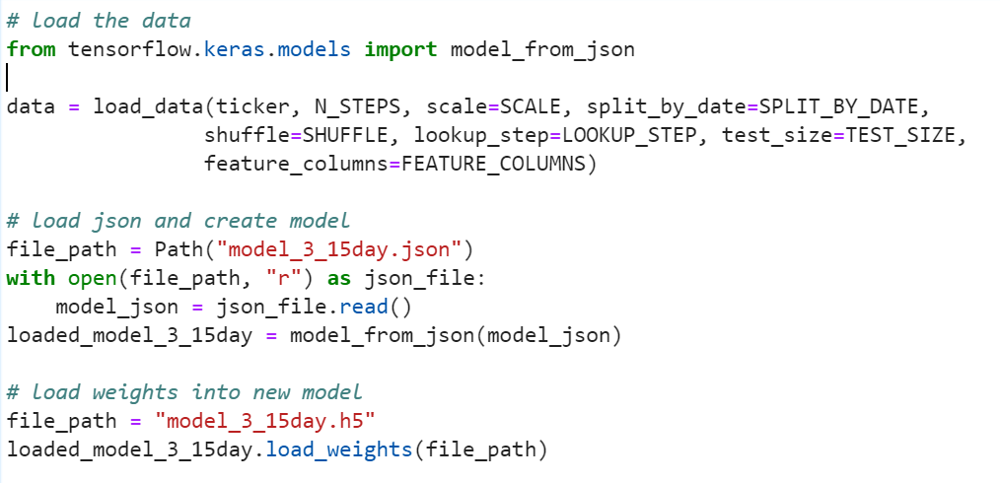

## Get Final Data:
This function takes the "model" and "data" dict to construct a final dataframe that includes the features along with true and predicted prices of the testing dataset

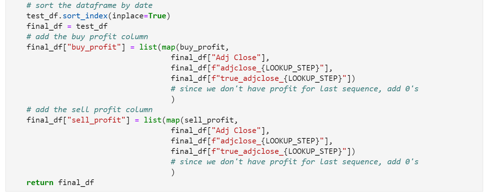

## Prediction:
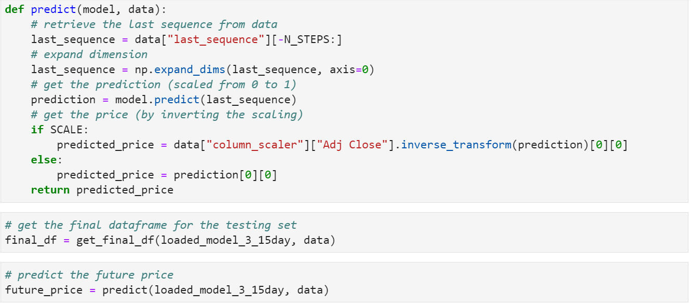

## Accuracy:
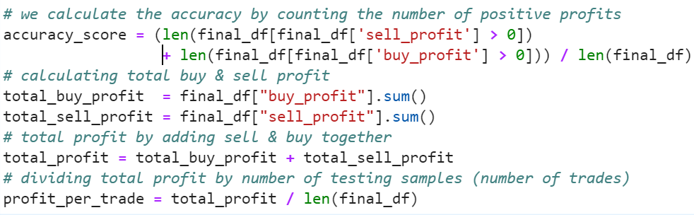

# Data Visualizations:
When deciding on a trading strategy, one might consider using indicators to help guide the decision whether to buy, sell or hold a position. Some of the indicators explored in the Bot-Time project are Bollinger Bands, EMA Crossover Point and RSI Indicators.  Here are some illustrations that show how they were used in the Bot-Time strategy.

## Plot:
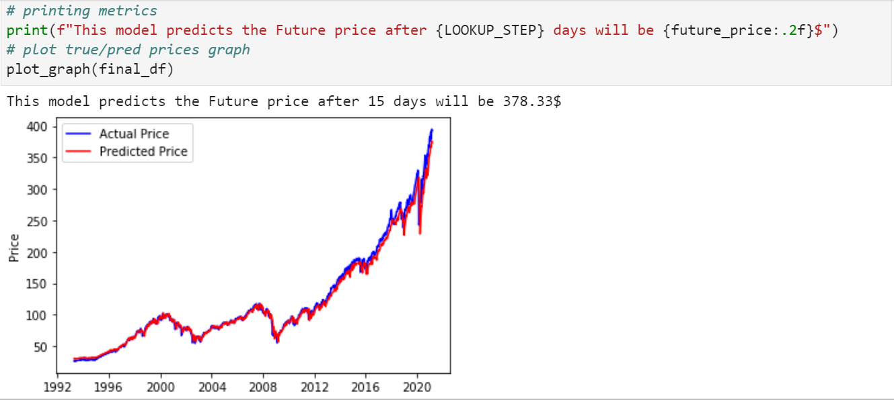

## Some Dash Visualizations:
Bollinger Bands:
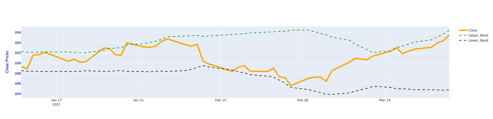

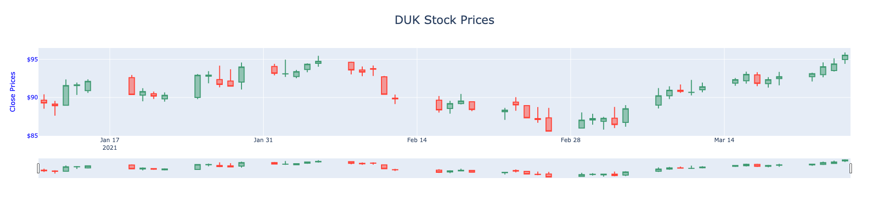

EMA Crossover Points:
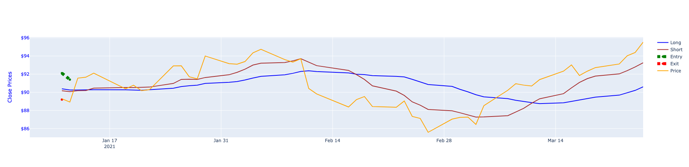

Prediction Chart:
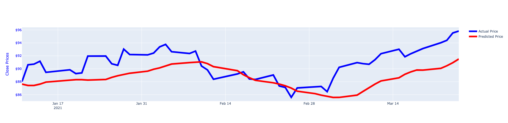

RSI Indicator Chart:
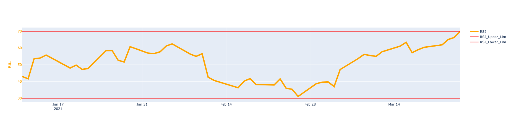

Webull Options Chain:
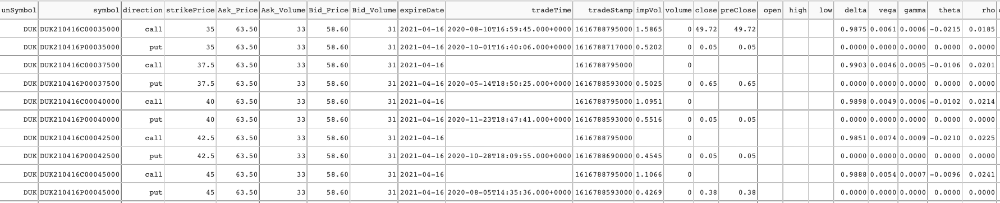

## Final Analysis:
Throughout the project, several models were tested, however, our third model proved to be the most accurate.

